<link rel="stylesheet" type="text/css" href="styles.css">

# Endeavour OS

## 1- Distribution History

- When the popular Arch-based distro Antergos ended
its run in May 2019, it left a friendly and extremely helpful community behind.
Within a matter of days after the announcement, Bryan Poerwoatmodjo opted for
the idea to continue the community feeling on a new forum that would invite any
Arch or Arch-based Linux user into the group. The idea received a lot of
enthusiastic response, more than enough for him to get the project going.

- Quickly, Johannes Kamprad, Fernando Omiechuk Frozi and
Manuel joined him to set up the project and when that happened, the plan changed
from preserving the former community on a new forum to creating a new distro
with that vibrant community at its core.

 

  

    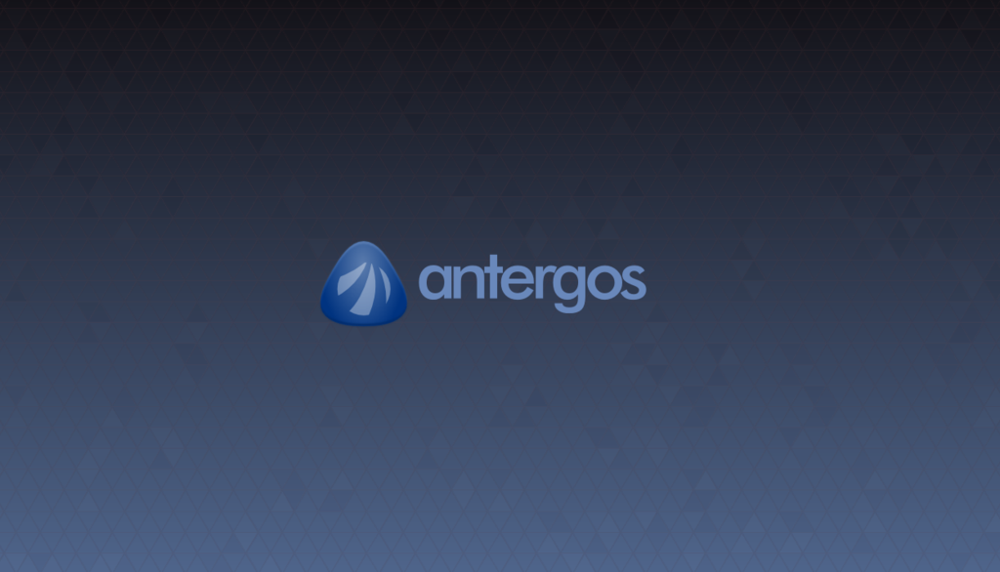
    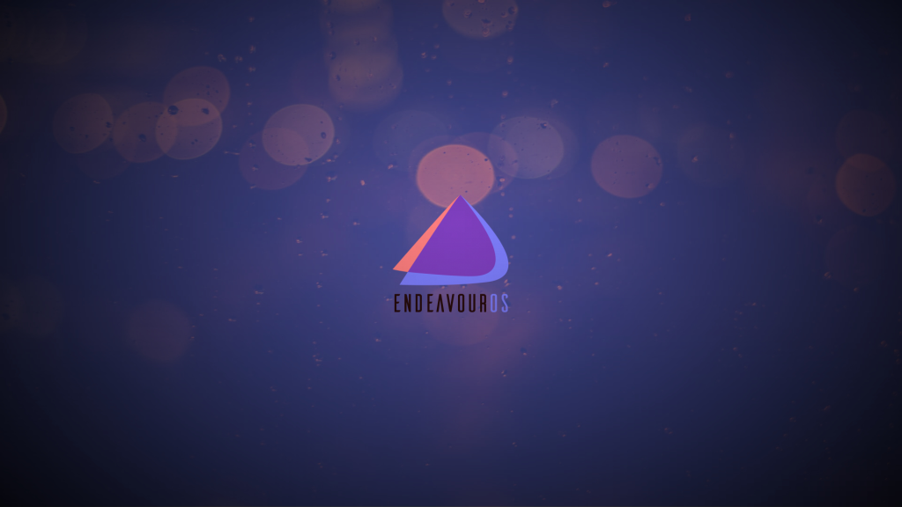

 

- With the plan to turn Endeavour into EndeavourOS, we deliberately travelled another road than Antergos did. It never was and it will never be our intention to be an Antergos clone. In fact, our departure point was the Antergos community and not Antergos the distro and that’s why we chose to let go of the look and feel of our predecessor and find our own voice in creating our own identity with the community at our side.

 

- To avoid the project becoming unmanageable, we decided in the early stage of development to provide a basic system that is close to Arch Linux. That’s why we are aiming for a Linux user with an intermediate level of knowledge who likes to handle a system that needs hands-on customization from the get-go, with the help of our main standout feature: Our vibrant and friendly community.

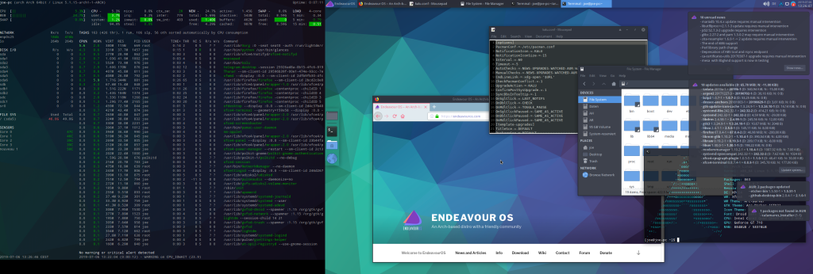

First release and a snapshot of the original website

- This resulted in a distro that is lightweight and ships with a minimum amount of preinstalled apps. An almost blank canvas ready to personalize.

- Flavors:
  - KDE
  - GNOME
  - Xcfe4
  - Cinnamon
  - Mate
  - Budgie
  - LXQT
  - LXDE
  - i3-wm

## 2- Intended Users
- Use cases:
  - Users who have some experience with Linux and are comfortable with tasks such as manual system configuration, command-line usage, and troubleshooting.
  - Users who are comfortable to use arch-based distro and know how to use pacman and Arch User Repository (AUR) but with user-friendly interface.
- Cases where don't use this distro:
  - Endeavour OS is not for servers because it is Rolling Release Model.
  - If you are new to linux, Endeavour OS may be not comfortable for you. 

## 3- Strengths & Weakness
- Strengths:
  - Pacman package manager is so fast.
  - Having access to Arch User Repositery (AUR).
  - Have many flavors like KDE(default), GNOME, Xfce4, i3-wm, Budgie, Cinnamon, Mate, LXDE and LXQT.
  - User-Friendly Installation Tool
- Weakness:
  - Limited Official Support
  - Rolling Release Model
  - Potientional Learning Curves

## 4- Installation Guide

### Direct installation
   1. Download the EndeavourOS ISO file from their website.
   2. Burn the ISO file to a blank DVD or USB drive, using a tool like Rufus or Etcher.
   3. Insert the DVD or USB drive into your computer and boot up from it.
   4. You will be prompted to select your language and keyboard layout. Make sure to choose the correct ones.
   5. You will then be taken to the partitioning screen where you can select how you want your hard drive divided into partitions for your install. If you are unsure what to do, select “guided partitioning” for an automated setup process.
   6. After selecting your partitions, you will be asked what packages you would like to install during the setup process. Select any packages you want installed, or leave them all unchecked for a minimal install.
   7. Once all of your options have been selected, click “Install” and let EndeavourOS take care of the rest! The installation should take about 15 minutes depending on your hardware specs and package selection.
   8. When the installation is complete, reboot your computer and enjoy EndeavourOS!
### VirtualBox:
   1. [Download the EndeavourOS ISO](https://endeavouros.com/)
   2. Download VirtualBox
   3. Create new VM
   4. To better performance change the vram for VM to 128MB from VM Settings 
   
   
   
   5. Start VM
   
   6. Choose first choice 
   
   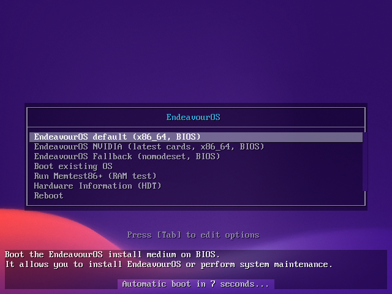
   
   7. Wait for booting 
   
   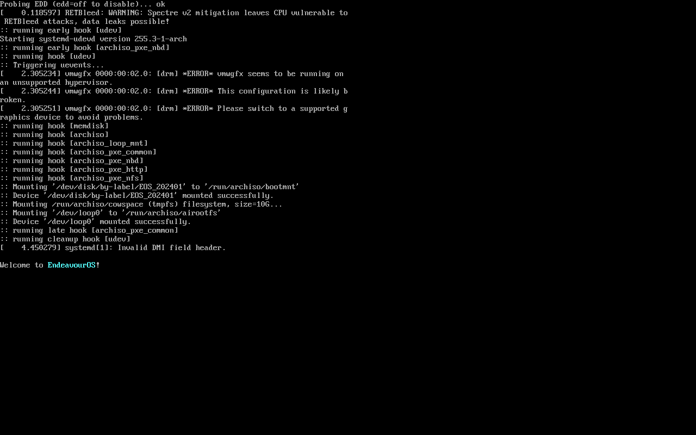
   
   8. Start the installer 
   
   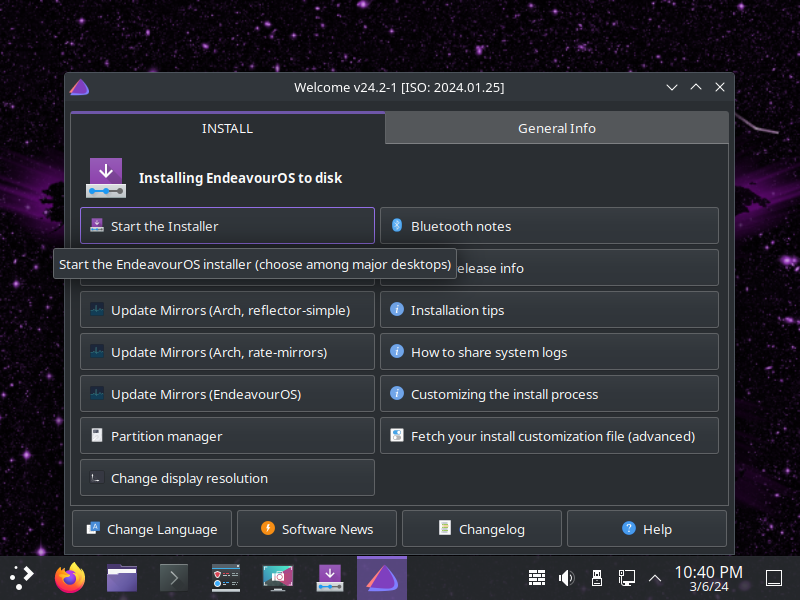
   
   9.  Choose online if you want to download other Desktop or offline if KDE good for you 
   
   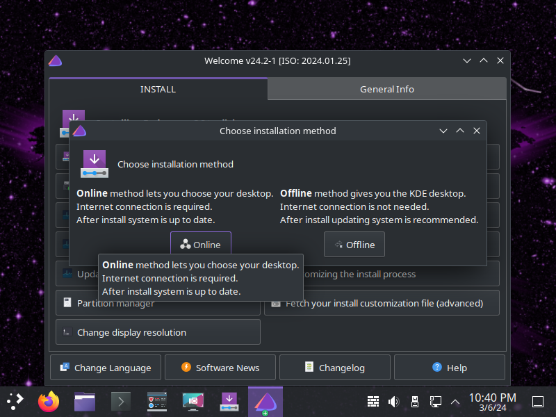
   
   10. Choose Language 
   
   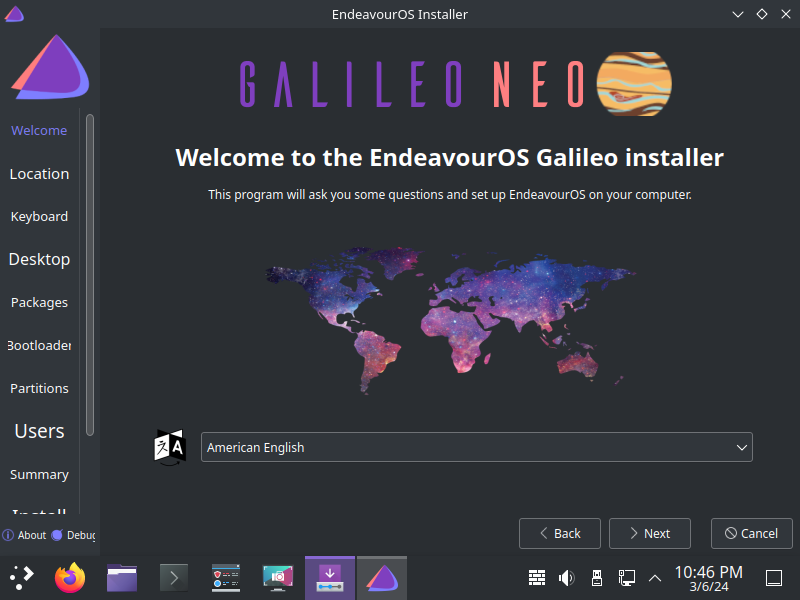
   
   11. Choose Location 
   
   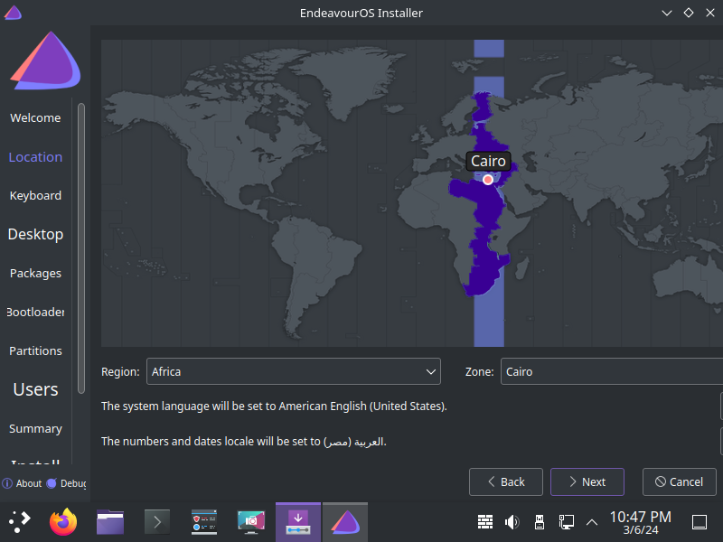
   
   12. Choose Keyboard Layout 
   
   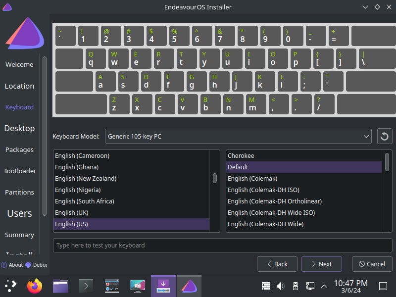
   
   13. Choose Desktop (if online installation) 
   
   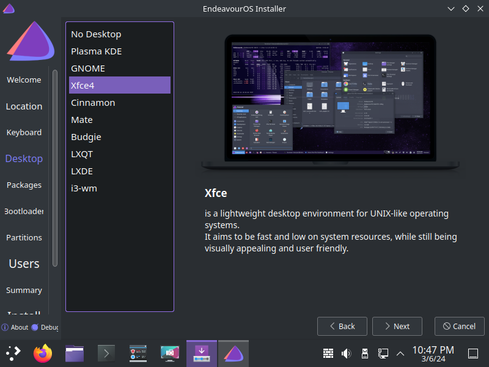
   
   14. Review Packages 
    
   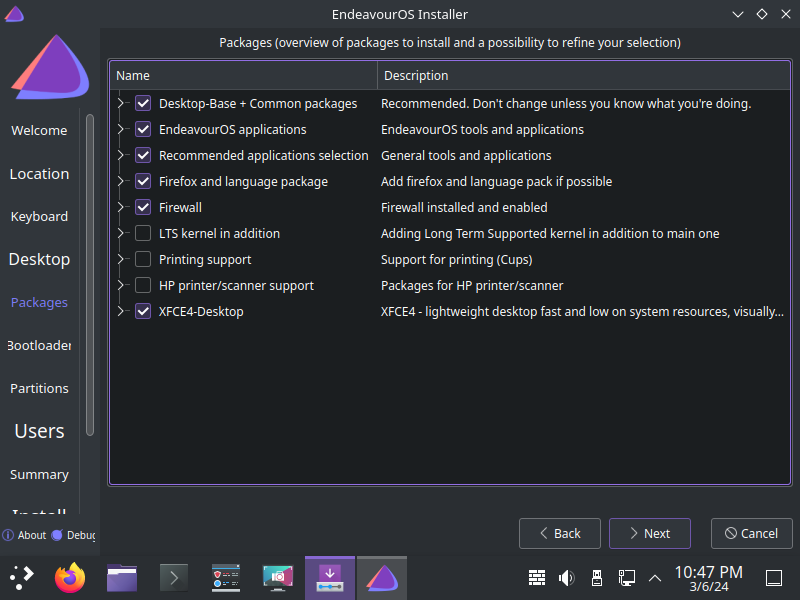
   
   15. Erase Disk because it is VM
    
   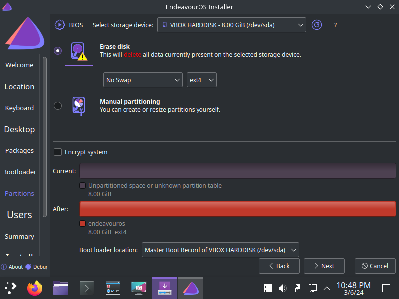
   
   16. Make User 
   
   
   
   17. Review Installation 
   
   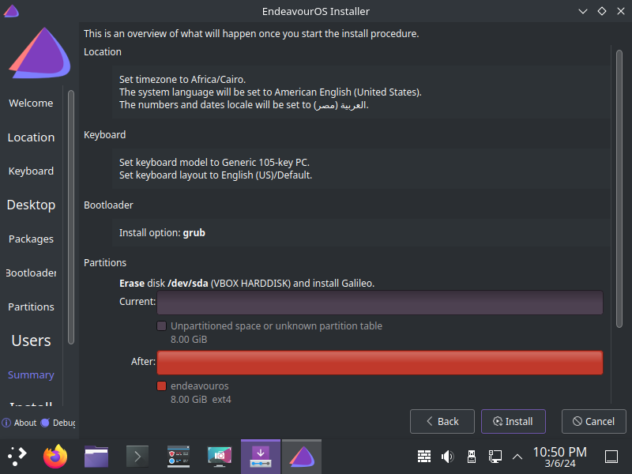
   
   18. Install 
   
   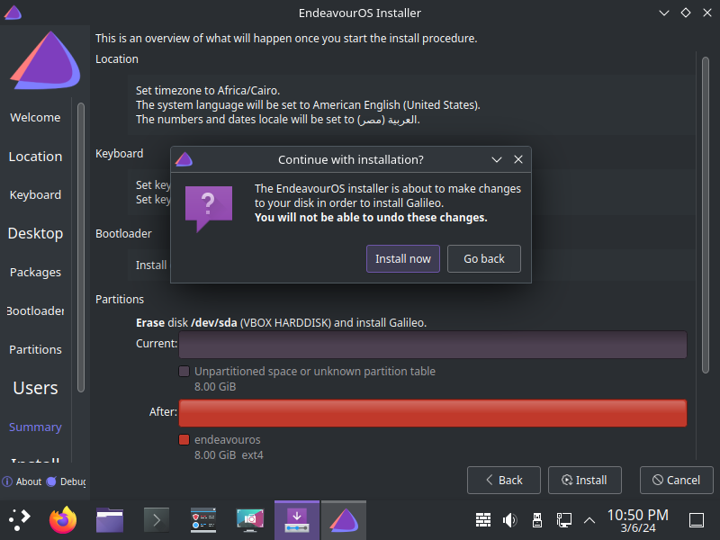
   
   19. Wait for 15 Minutes 
   
   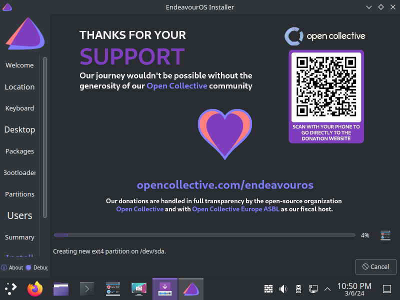
   
   20. Installation Done 
   
   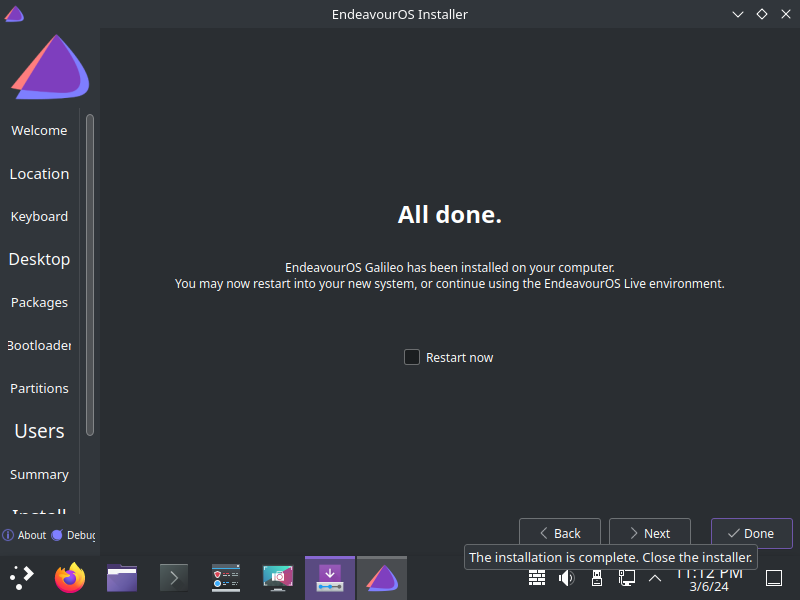
   
   21. Poweroff VM 
   
   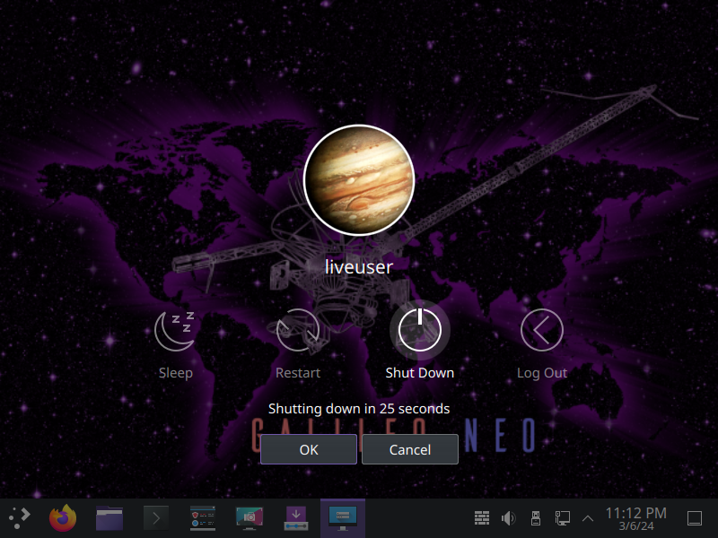
   
   22. Remove ISO from VM 
   
   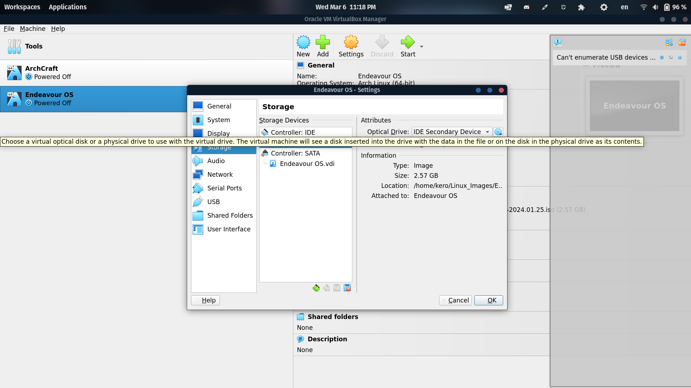 
   
   23. Start VM & Choose to boot Endeavour OS 
   
   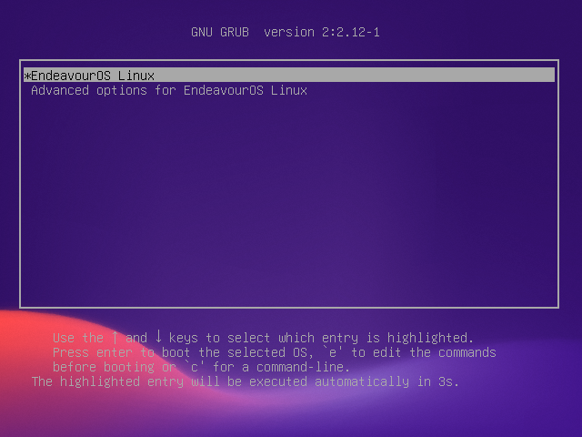
   
   24. Write Password 
   
   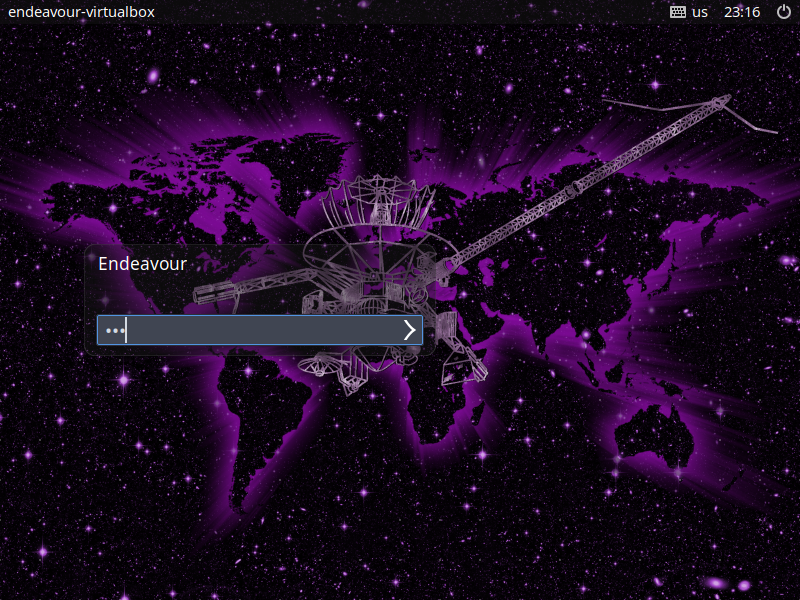
   
   25. Installation Done  
   
   
   
   26. if you Restarted after install and found Installation Menu because you don't remove ISO from VM. Choose Boot existing OS Here 
   
   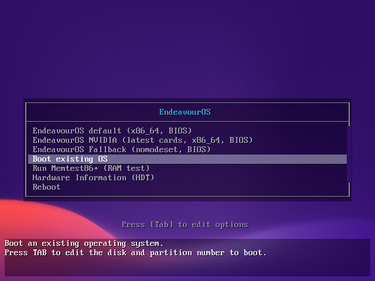
   
---
### References
- [EndeavourOS site](https://endeavouros.com/)
