# openSUSE Tumbleweed

## 4. Installation Guide

1. You can get openSUSE Tumbleweed's ISO image from [here](https://get.opensuse.org/tumbleweed/).

   ### On the Download tab you will find download links for different architectures:

   1. Intel or AMD 64-bit desktops, laptops, and servers (AMD64/Intel 64)

   2. UEFI Arm 64-bit servers, desktops, laptops and boards (AArch64)

   3. PowerPC servers (little-endian, ppc64le)

   4. IBM Z and IBM LinuxONE (IBM servers, s390x)

   ### You also have the choice between two different images for download: Offline Image and Network Image.

   | Offline                                                                                | Network                                                                                                                                 |
   | :------------------------------------------------------------------------------------- | :-------------------------------------------------------------------------------------------------------------------------------------- |
   | Contains all packages needed for installation and is perfect for offline installation. | It is very small and downloads system and packages from online repositories.                                                            |
   | downloads the latest snapshot and builds the system upon that one.                     | builds the system upon the snapshot at the time you downloaded it. if it was a year ago you build it based on the snapshot from a year. |

2. You can then burn the ISO image to a USB stick using this [link](https://cubiclenate.com/linux/opensuse/basic-installation-guide/) in Writing the Image to USB Drive
   section for Windows version or Mac version or Linux.
3. Plug the USB with OpenSUSE onto your computer, and reboot it. Next, get into the boot menu when your computer is starting up, and select the OpenSUSE device to boot into, and you should see the boot menu of OpenSUSE.

   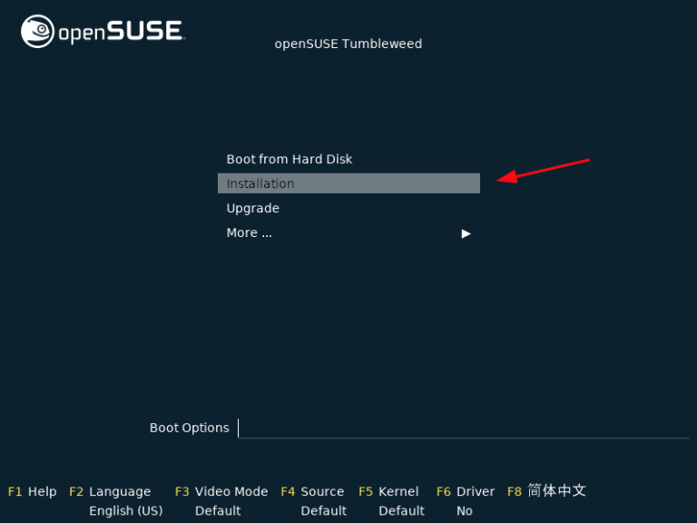

4. You will see a bunch of boot messages splashed on the screen.

    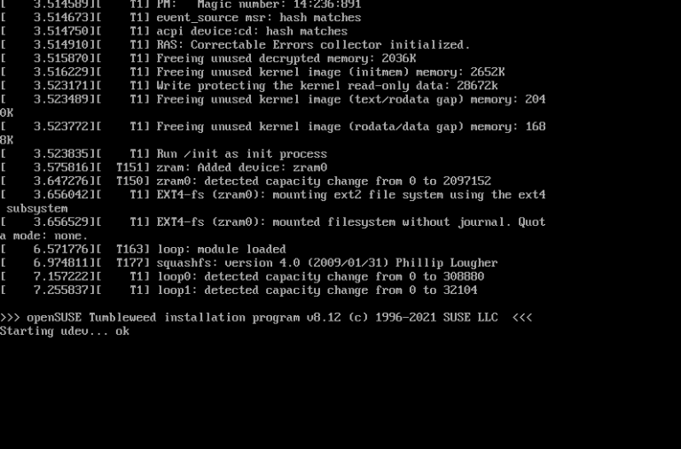

5. Next, the installation wizard will initialize the network configuration. This includes detecting network devices and reading network configuration.

   Once complete, click on `Next` to proceed to the next step.

   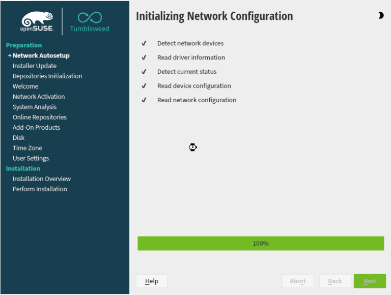

6. In the next step, be sure to configure the preferred language, keyboard, and accept the license agreement and then click `Next`.

    

7. In the next step, be sure to configure the preferred language, keyboard, and accept the license agreement and then click `Next`.

    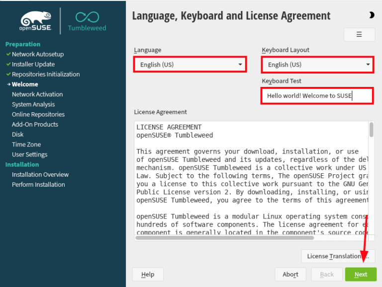

8. After accepting the license agreement, you will get the following prompt. This prompt is basically asking you if you want to enable the online repositories for your system. Click `Yes` to enable online repositories, then click `Next`
   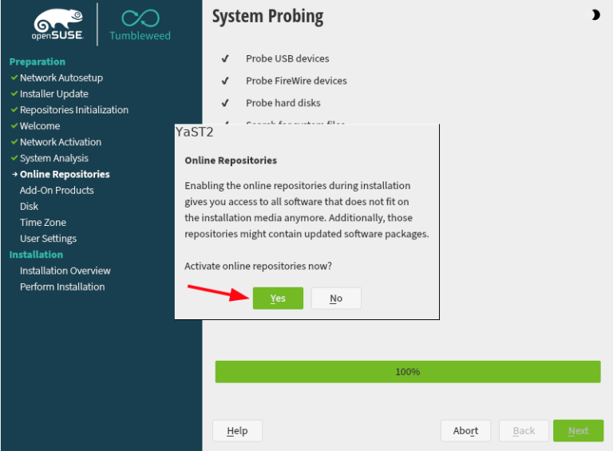

9. Next, you can choose which repositories you want to use. You can use OSS and non OSS repositories, which means your system will be able to download open source and not open source softwares.

   Now this depends how you plan to use OpenSUSE, if you are planning to use it as a desktop OS, then you may need to use all 4 repositories, if you plan to use it only as a server OS, then you will most likely be using open source softwares.
   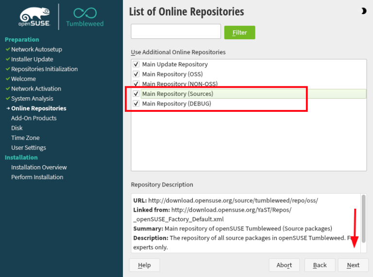

10. Next, select the System Role.

    We are going to install OpenSUSE on desktop, so we chose `Desktop with` `any one` , click to `Next` button once choosing the system role.

    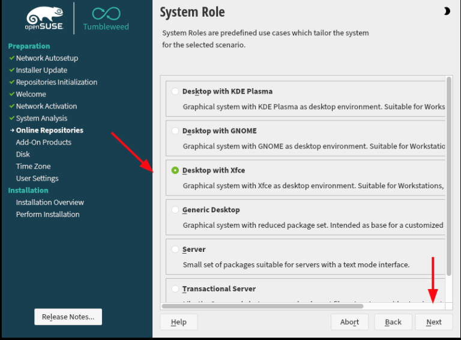

11. Now you need to setup partitioning. OpenSUSE will suggest a layout that you can use instead of creating partitions manually. For example, the layout that we were suggested was :

    - Delete partition
    - Mount partition
    - Create partition

    If you don't want to use the suggested layout, you can create partitions manually.

    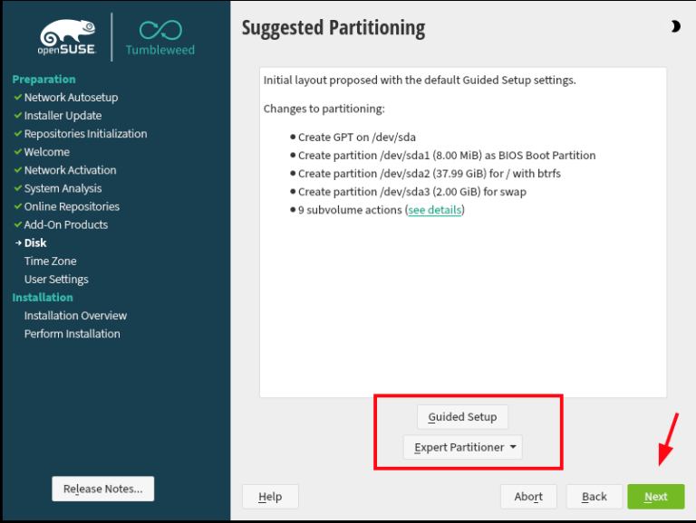

12. Next, you need to select the timezone. Set your preferred timezone, and proceed by clicking the `Next` button.

    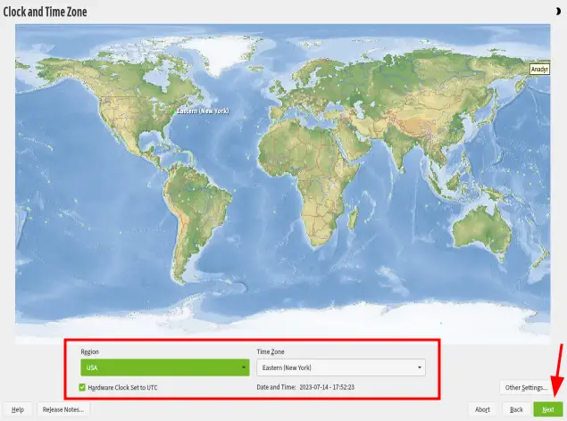

13. In this step, configure a local user account by providing the name and password of the user and click `Next`.

    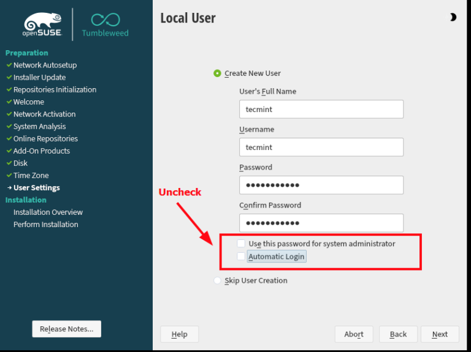

14. Then create the root user by providing the root user’s password and clicking `Next`.

    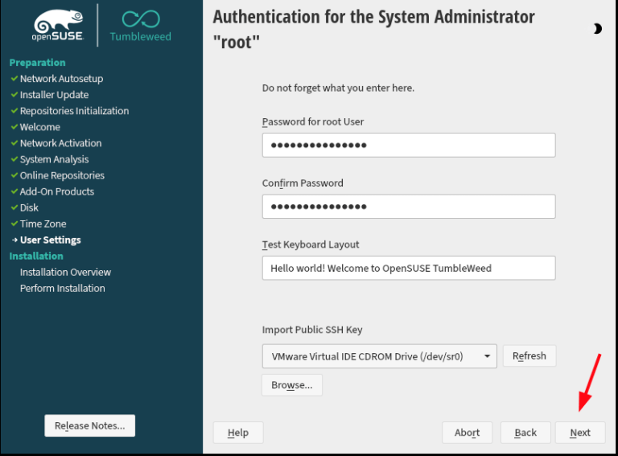

15. Next, you will see the following window. This window shows your current configurations, I don't recommend making changes on this step, so simply proceed to Install OpenSUSE by clicking the `Install` button.

    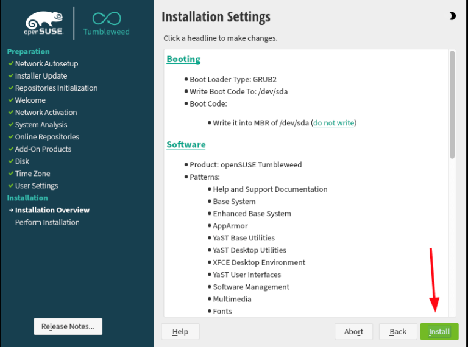

16. Next, click to `Install` button to confirm the installation.

    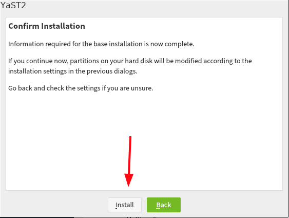

17. And you should see the following window, this means OpenSUSE's installation has begun

    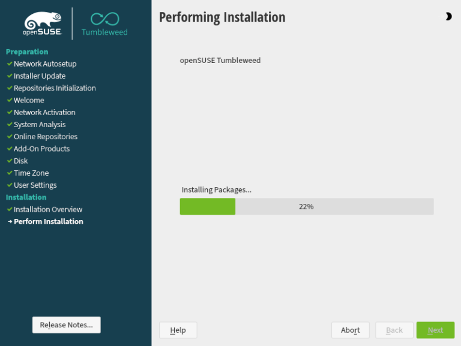

18. Once the installation is complete, the installer will automatically reboot. On the GRUB menu, select the first option and hit ENTER.

    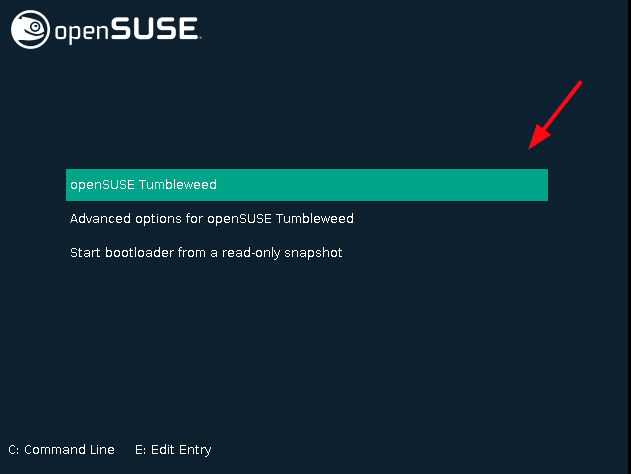

19. Next, log in using the local user’s login credentials.

    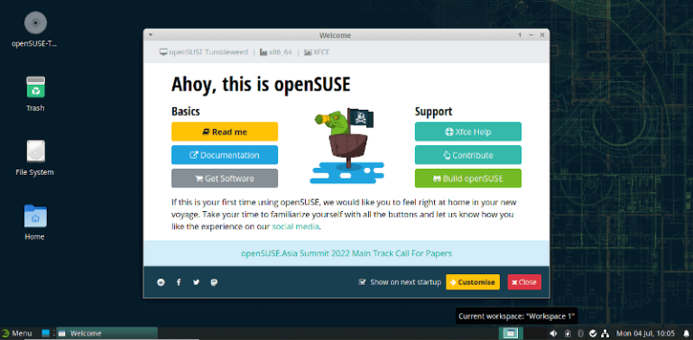

