# parrot

- ## What's it based on?
	Parrot OS is a Debian-based Linux distribution that emphasizes security, privacy, and software development.
- ## History of Parrot Os
  - ### What is the ParrotOs?
	ParrotOs is a GNU/Linux distribution that is free and open-source, based on Debian stable, and specifically tailored for security experts, computer forensics, reverse engineering, hacking, penetration testing, anonymity, privacy, and cryptography. Developed by Frozenbox, it features MATE as the default desktop environment and offers a comprehensive portable toolkit for IT security and digital forensics tasks. In addition, it provides all the necessary tools for app development and online privacy protection. ParrotOs is offered in three editions: Security, Home, and Architect Editions, and can be used as a virtual machine on Raspberry Pi and Docker. Version 5.0 LTS has restored support for ARM systems (arm64 and armhf) and now includes images for boards like the Raspberry Pi. While the operating system comes with MATE Desktop environment pre-installed, users have the option to install alternative desktop environments.

  - ### What is the History of ParrotOs?
	Parrot Security OS is designed and developed by security expert Lorenzo "Palinuro" Faletra and a team of other security experts, open-source developers, digital rights advocates, and other Linux enthusiasts. The initial public launch was in April 2013. Parrot OS version 1.0, codenamed Hydrogen, was launched in July 2014.

	In September 2015, Parrot OS version 2.0, codenamed Helium, was released. In June 2016, the third version, codenamed Lithium, was released. In May 2018, version 4 was launched. The latest version of Parrot OS is 4.11, which was published in March 2021.

	As stated previously, Parrot OS is built on Debian, while the Parrot team considered moving to Devuan in 2017 owing to system issues, which were eventually resolved. The Parrot OS team stopped supporting 32-bit in January 2019 to focus their work on x64 and ARM. In August 2020, the XFCE Desktop environment (Home Edition) was officially supported, making the system lighter.

- ## Advantages & Disadvantages
  Parrot OS is a well-known Linux distribution that prioritizes security, privacy, and development. Let's explore the advantages and disadvantages of Parrot OS below:
- ## Advantages:
 - Enhanced Security: Parrot OS offers a range of built-in security features, including a sandbox system, cryptography tools, and anonymous browsing tools.
- Privacy Protection: Parrot OS is designed to safeguard users' privacy by providing secure and anonymous browsing options, as well as encrypted communication channels.
- Extensive Toolset: Parrot OS comes with a wi1. Enhanced Security: Parrot OS offers a range of built-in security features, including a sandbox system, cryptography tools, and anonymous browsing tools.
- Lightweight Design: Parrot OS is specifically designed to be lightweight, making it suitable for running on older hardware.
- User-Friendly: Parrot OS boasts a user-friendly interface and is easy to install and configure, making it an excellent choice for beginners.
- Versatility: Parrot OS is a versatile operating system that can be utilized for various purposes, including penetration testing, digital forensics, cryptography, and development.
- Free and Open-Source: Parrot OS is freely available as open-source software, allowing users to download, use, and modify it according to their requirements.
- Active Community: Parrot OS benefits from an active community of developers and users who contribute to its development, provide support, and share knowledge and resources.
- Regular Updates: Parrot OS is regularly updated with the latest security patches and software updates, ensuring users have access to the most up-to-date tools and features.
- High Customizability: Parrot OS offers a high level of customization, enabling users to configure and adjust various aspects of the operating system to suit their specific needs.
---
- ## Disadvantages:
 - Limited mainstream support: Despite having a supportive community, Parrot OS may lack the same level of mainstream support as more popular Linux distributions.
 - Not suitable for everyday use: Parrot OS is primarily tailored for security and development purposes, making it less than ideal for daily tasks.
 - Steep learning curve: Certain tools in Parrot OS may pose a challenge for users due to their complex nature, requiring significant effort to master.
 - Not optimized for gaming: Parrot OS is not intended for gaming, making it a less favorable choice for users seeking a gaming-friendly operating system.
 - Limited software support: Parrot OS may not offer the same extensive software support as other Linux distributions due to its lower popularity.
 - Limited software availability: Despite its wide array of pre-installed tools, Parrot OS may not provide the same level of software availability as more mainstream distributions.
 - Hardware compatibility issues: Users with older or less common hardware configurations may encounter compatibility problems when running Parrot OS.
 - Dependency issues: Installing and configuring software in Parrot OS may involve resolving dependency issues, which can be time-consuming and daunting for newcomers.
 - Documentation challenges: While Parrot OS offers comprehensive documentation, some users, especially those new to Linux, may struggle to comprehend or navigate it effectively.
1 - Resource-intensive tools: Certain tools in Parrot OS may demand significant system resources, potentially causing performance issues on older or less powerful hardware.
---
- ## Who is it for and Who is it not for?
   - ### Parrot OS is tailored for cybersecurity professionals, ethical hackers, and pen testers who require a robust and adaptable platform for their tasks.
        - It is equipped with an array of tools for network analysis, vulnerability assessment, and penetration testing, as well as tools for digital forensics, reverse engineering, and cryptography, making it a versatile choice for cybersecurity experts. 
     However, it is important to highlight that Parrot OS is not limited to these specific uses and can be utilized by individuals interested in a privacy-focused, secure, and open-source operating system.
     - #### Parrot OS is primarily designed for cybersecurity professionals, ethical hackers, and pen testers who need a powerful and versatile platform to carry out their work. As such, it may not be suitable for those who are looking for a more user-friendly and straightforward operating system.
       - Parrot OS requires some level of technical knowledge and expertise to use effectively, and it may not be suitable for beginners or casual users who are not familiar with Linux-based operating systems.
       Additionally, Parrot OS is not designed for general-purpose computing tasks like web browsing, multimedia, and productivity applications. While it is possible to use Parrot OS for these purposes, it may not provide the same level of user experience as other more mainstream operating systems.
       Finally, Parrot OS may not be suitable for individuals who do not require the advanced security and privacy features offered by the operating system. If you are simply looking for a basic operating system for everyday use, Parrot OS may not be the best choice.

   - ### ParrotOs is good for whom?
      + Parrot OS caters to the needs of cybersecurity professionals, ethical hackers, and pen testers by offering a robust and versatile platform for their work. With a wide array of tools for network analysis, vulnerability assessment, and penetration testing, it is an essential resource for these experts.
	  + Moreover, Parrot OS prioritizes privacy and security, boasting features such as built-in encryption and secure boot capabilities. This makes it an ideal option for individuals who prioritize data protection and online privacy.
	  + Furthermore, Parrot OS appeals to users who value open-source software and seek a free operating system with unrestricted access to its source code.
      + Lastly, Parrot OS is a suitable choice for those who enjoy customizing their operating system and prefer a more adaptable and open computing experience. Its lightweight and modular design allows users to personalize the system according to their specific requirements and preferences.

   - ### Parrot is not good for whom? 
	  + Parrot OS may not be the optimal option for individuals who lack familiarity with Linux-based operating systems or those who seek a more user-friendly and uncomplicated platform. It necessitates a certain level of technical knowledge and expertise to utilize effectively, making it less suitable for beginners or casual users.
	  + Furthermore, Parrot OS is not specifically designed for general-purpose computing tasks like web browsing, multimedia, and productivity applications. Although it is feasible to employ Parrot OS for these purposes, it may not deliver the same level of user experience as other more widely used operating systems.
      + Parrot OS may also not be appropriate for individuals who do not require the advanced security and privacy features provided by the operating system. If you simply require a basic operating system for everyday use, Parrot OS may not be the most advantageous choice.
	  + Lastly, Parrot OS may not be compatible with all hardware configurations, so it is crucial to verify the system requirements before attempting to install it.
---
# Installation
## How to install Parrot OS
- #### Now we will explain How to install Parrot
    - You need to download Parrot OS installation Disk image
    - There are many Parrot OS edition , You can download them from [Parrot OS ISO](https://www.parrotsec.org/download/) , and it will be like this   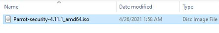
    -  There are two ways to install first by selecting the Live Mode (but every time you turn off the machine , Everything in the machine will be erased) and 2nd by selecting the Install option and both will work the same. we will go with the 2nd method
Select the Parrot OS in Left Pane and click on start for installation.   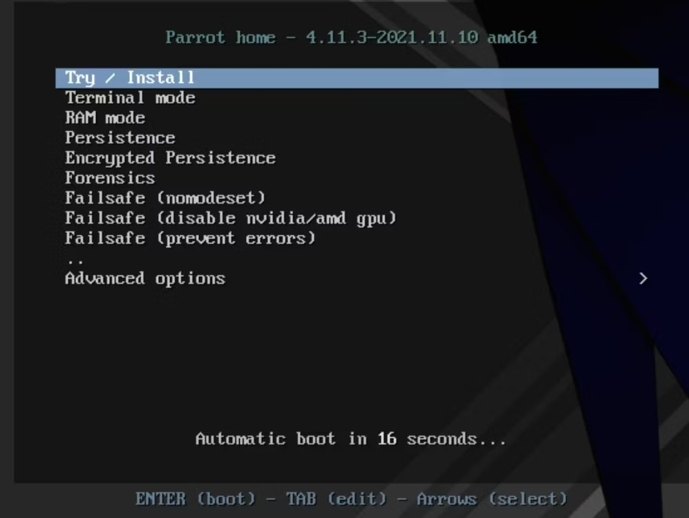
    - In its home screen, Select Install Parrot to begin the installation.   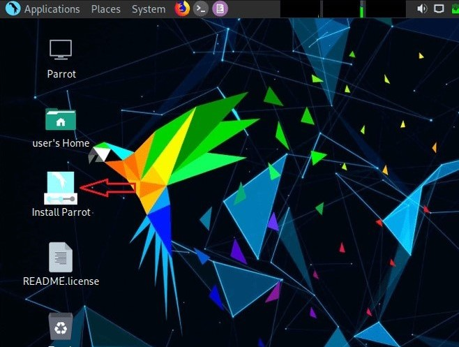
    - Provide your location. Click on Next.   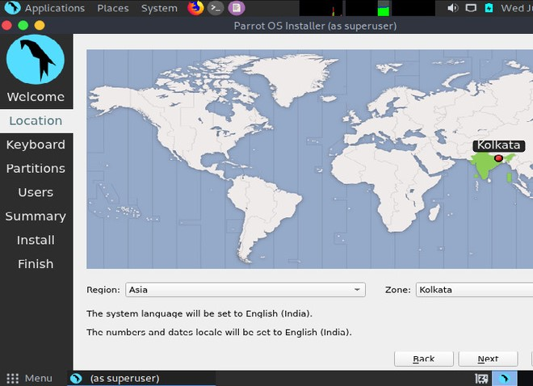
--- 
    - Select the default language according to your keyboard below is selected for QUERTY keyboard layout.   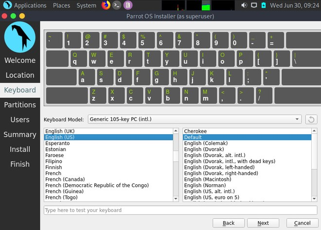
    - Click on the “Erase Disk” radio button (recommended for beginners ). It will automatically partition your virtual disk according to the size you have provided to it. Click on Next.   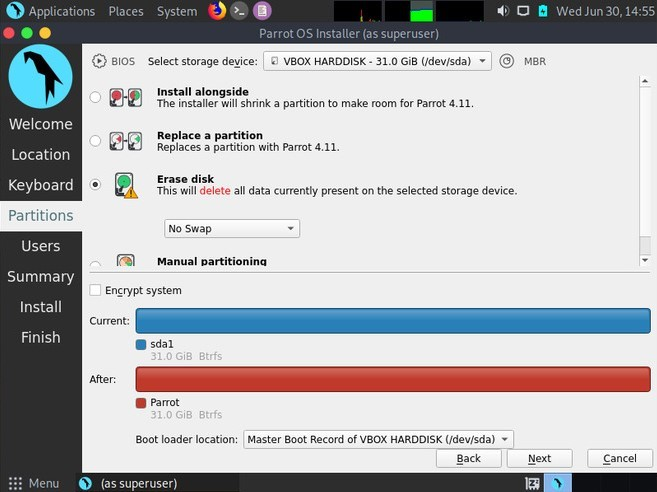
    - Finally, you just need to create a user( root user) and password to access it whenever you want so that your data is saved.   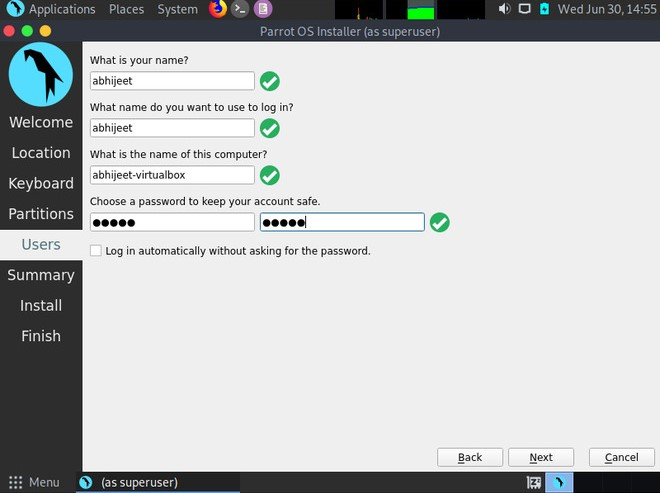
    - On the last page, it will show all the settings that you have selected or done till now so that you can verify it one last time before the final install procedure starts.   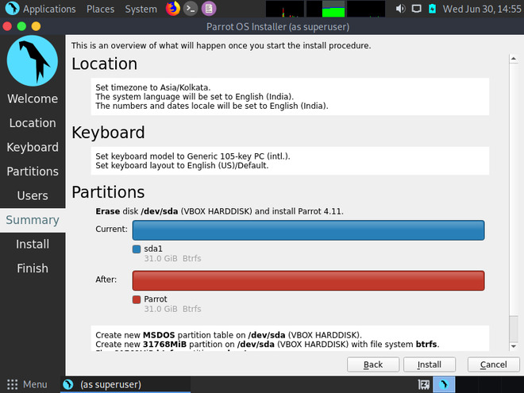
    - After verification, if you are not satisfied and change some settings then you can either click on the Back button or click on the Cancel button. If satisfied, then click on the Install button, it will prompt you to continue installation, then click on Install Now, to begin the installation.   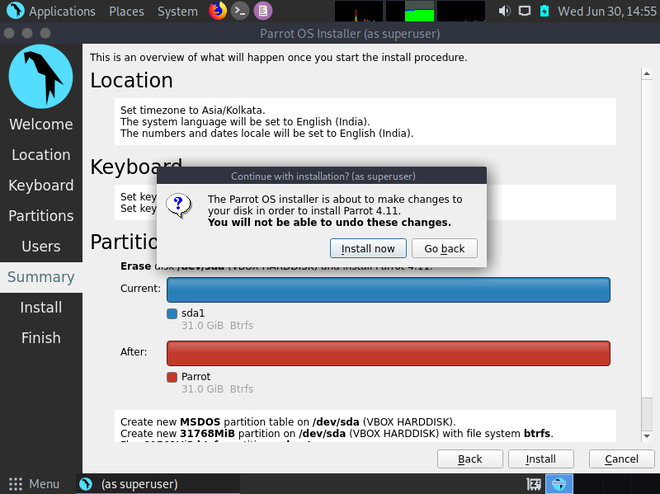
    - Now we just need to wait for at least 20-30 minutes for the installation to finish up. After it has done, it will prompt to restart. Click on it restart so that your virtual machine will save all the necessary changes that have been made.   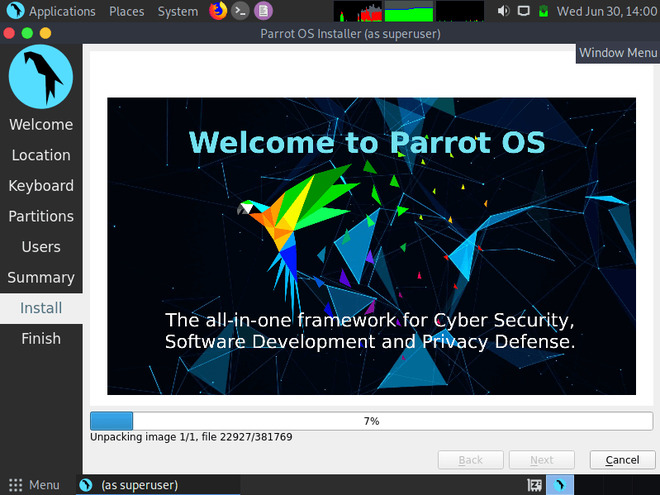
    - After restart you will see that it’s done.   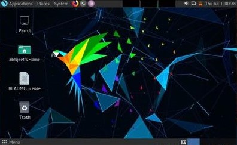
    - #### Now Your Parrot OS is successfully installed in your PC with all the basic functionalities that are required. :D
---

- ## Features of Parrot OS
  ### It is intended for daily Linux users, software developers, system administrators, system programmers, computer science/engineering students.
    + Full office suite.
    + Multimedia production tools including VLC and GIMP.
    + Anonymity tools such as AnonSurf, TOR, and Firefox pre-installed Ad-blockers.
    + Full disk encryption and all encryption tools including zulucrypt, sirikali, and more.
    + Development tools such as VSCodium and Geany, and much more.
    + Support for popular programming languages/frameworks such as Nodejs, Go, Rust, Python, Java, and many other, compilers, interpreters, libraries, and development frameworks either pre-installed or installable from the supported repositories.
    + Parrot OS is completely free and developed by the open-source community, hence, giving users the source code to customize it as per their needs.
    + Parrot OS is very lightweight and runs amazingly well on legacy hardware with a smaller number of resources.
    + Parrot OS receives constant timely updates to keep ahead of the other tools and ensures that it is completely sandboxed at the same time.
    + Parrot is recommended for users who are passionate about customization
        + Custom Kernel: Along with all the giant catalog of scripts, parrot security has its own hardened Linux kernel, modified explicitly to provide as much security and resistance to hackers as possible as the first line of defense.
        + Customizable Desktop: They provide a choice between two different desktop environments, MATE, which comes pre-installed by default, and KDE. You can think of desktop environments as the main UI for a Linux distribution for those unfamiliar with Linux terminology.
    + Variety of Apps: All the tools you find in Kali Linux, a well-known penetration testing operating system, are present in Parrot Security, and then a few extra ones for good measure.

---
- ## Extra Information about parrot!

	* Desktop Environment: By default, Parrot OS uses the `Mate desktop environment`. 
    		+ However, users can install other Desktop Environments.

	* Desktop Diplay Manager: `Lightdm`
	* Package manager: Parrot uses `apt` package manager when we want to download packages or update the workspace 
    	+ apt-get update
    	+ apt-get upgrage
    	+ apt install ....
	* System Requirements:
    + **The minimum system requirements to run a full-fledged installation of parrot security are as below:**
        + No Graphical Acceleration Required
        + Minimum 320MB RAM is required
        + A minimum 1GHZ dual-core CPU is required
        + It can boot in legacy and UEFI modes as well
        + At least 16GB of hard disk space is needed to install the operating system

+ Parrot OS is designed for security, privacy, and development, Parrot ships with an assortment of IT security and digital forensics tools, utilities, and libraries; development and programming tools; as well as privacy protection tools.

- #### Parrot has come a long way since its inception. It has grown into a quintessential framework for Cyber Security operations. It has advanced remarkably thanks to the core team and an active community of contributors.

+ Parrot has different editions for different use cases.
    * Parrot Security Edition
    * Parrot Home Edition
    * Parrot Cloud Edition
    * Parrot Architect & IoT
    * Parrot Raspberry Pi Images

+ The Home edition is recommended for home users looking for privacy and an alternative to Windows.

+ In Parrot OS, several tools dedicated to penetration testing are specifically built for security researchers.
    * TOR
    * AnonSurf
    * OnionShare
    * I2P
    * NMAP
+ User's Opinions and reviews about Parrot OS 
    * "Best open source OS to do penetration for ethical hacking."
    * "An alternative of Kali seems quite light"
    * "This is mainly for security professionals it has in-built all pre-installed tools"
    * "Modern Linux distribution for security professionals"
    * "Stable OS, Friendly, Secure, Continue Update, Support Community"
    * "Good UI plus Security features"
    * "The fastest growing distribution for offensive security and pentesting"
    * "Preferred this over Kali"
    * "Excellent for pen testing. If you use Kali, you'll love Parrot"
    * "The OS for the cyber security professionals"
    * "Best and Suitable Platform for Penetration test"

