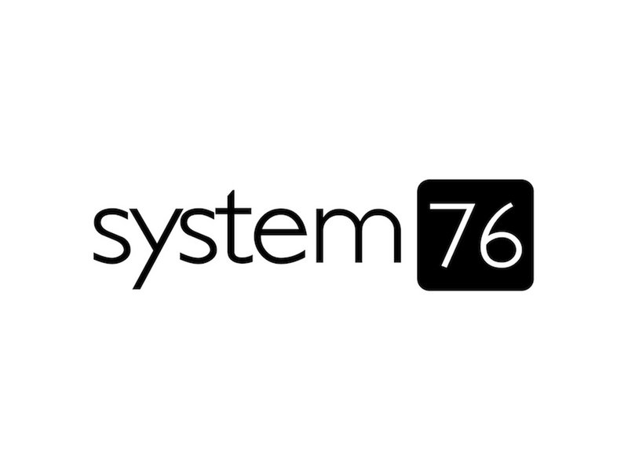
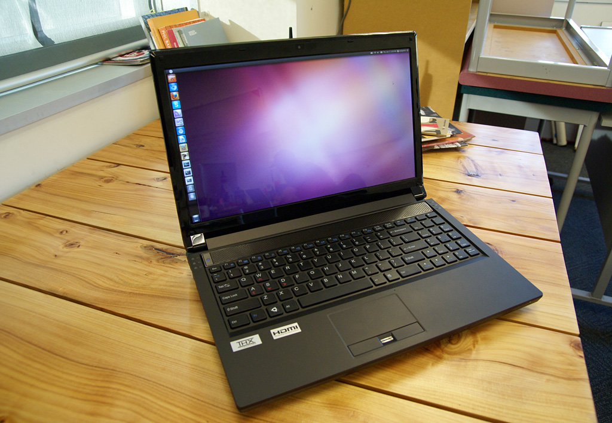
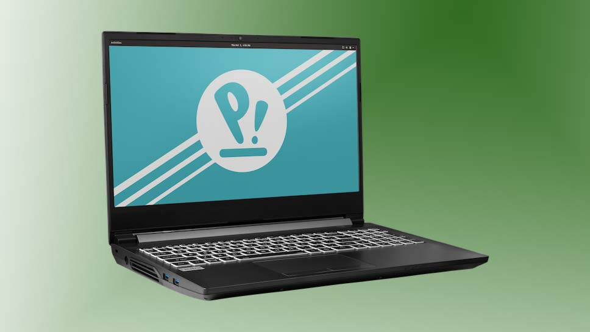
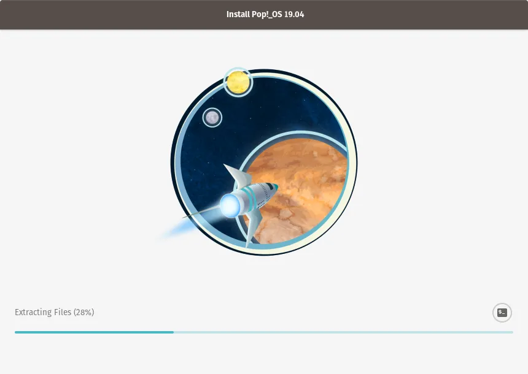
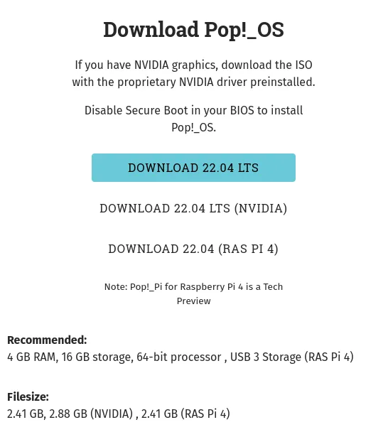
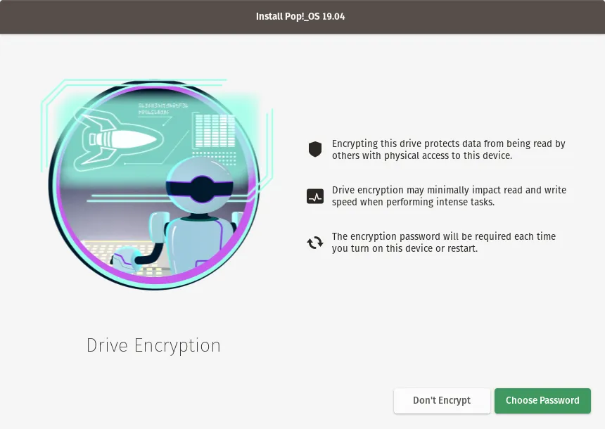
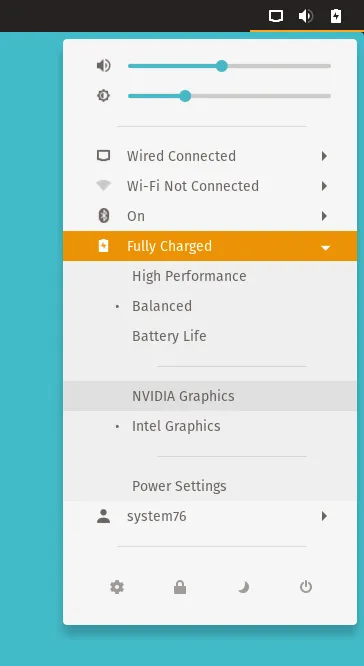
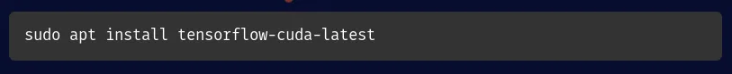

# Pop!\_OS

## Distribution History

- ### Release date:
	- Pop!\_OS was made by System76, but before we dive into Pop!\_OS release date, let's talk about System76.
		

	- System76 is an American computer manufacturer founded by **Carl Richell** and **Erik Fetzer** In 2003 to sell computers with ***Linux*** operating systems preinstalled.
		
	- In 2005 all computers that shipped from System76 came out of the box with Ubuntu preinstalled, and this is **very important** information.
		
	
	- But in ***2017*** System76 decided to make a **BIG** change in their computer lineup and the ___Linux___ community; they decided to make their distribution the best distribution ever "**at least in my opinion**", they called it Pop!\_OS, and beginning from that moment they shipped all there computers with it. 
		
	- 
- ### Based on distribution:
	- Now let's talk more in technical detail, do you remember when I told you that System76 shipped their computers from 2005 with Ubuntu, guess what is the base distribution of Pop!\_OS!!..... you are right, it's Ubuntu.

	- So, the question is why System76 decided to make their distribution!!?
	  after small research, it turns out that they want to make more simpler OS for both beginners and professionals but we will dive into this in the Intended Users section.

---
## Intended Users
- ### Real life use cases:
  - to answer on the question "__Isn’t Pop!\_OS just a re-skinned Ubuntu?__".... and the short answer is __NO__.
  - Pop!\_OS has been designed with vibrant colors, a flat theme, and a clean desktop environment, but developers created it to do so much more than just look pretty. (Although it does look very pretty.)
  - Pop!\_OS is designed to be:
    - **easy to use** for Linux beginners from the beginning to the end, also it's tech-savvy professional. 
      
    - **for all**, Pop!\_OS comes with 3 versions:
      - the base version for Intel/AMD devices.
      - NVIDIA version that come with NVIDIA driver out of the box.
      - Raspberry Pi 4 version for Raspberry SOC.

  

  - **More Privacy**, Pop!\_OS comes with encryption enabled by default, and reporting through Ubuntu disabled out of the box.
    
  - **more lightweight**, Pop!\_OS avoid providing some larger programs by default that slow down your computer, it's give you the basics.
  - **Featured across the board**, Pop!\_OS come with some major improvements:
    - **Vulkan** drivers and libraries are installed by default to get the most out of your GPU’s performance.

    - The power profile picker in the top right menu easily toggles between high performance, balanced, and battery saver modes.
    

    - For scientific workloads, installing **CUDA** and **TensorFlow** is made simple with a single command line.
    

    - systemd-boot bootloader and the automatic configuration tool System76 have created for it called kernelstub replace the outdated GRUB bootloader used on Ubuntu.   

- ### Cases where it might not be beneficial to use this specific distribution.
  - In my humble opinion you **don't** need Pop!\_OS in case you are not: 
  	- Software Engineer 
  	- ML&DL researcher
  	- Bioinformatics Engineer
  	- Media Production man
  	- Gamer
  	- regular user
  - if you are not one of the above, you may not need Pop!\_OS... but give it a try. 

---
- ## Strengths and Weakness

  - Installation difficulty
  	- One of the most brilliant features in Pop!\_OS is that the install operation is **SO EASY**, At the same time it protects your file "**if you want**" by encrypting the system, this operation is done by simple clicks here and there.... remember the main goal of Pop!\_OS is to be as simple as possible for all.
  	
  	- **DON'T WORRY**, Keep going to the "**Installation Guide**", I'll explain how to install Pop!\_OS for you. 

  - Software availability. (i.e. How hard is it to install non-FOSS Software?)
  	- **LET's** be more realistic, we aren't in heaven and we can't get everything we need, we must **abandon** somethings in our lives to gain another.
  	
  	- when you use Pop!\_OS or any other Linux distributions there are a bunch of programs you can't run naively, an example is "Visual Studio", and there is a lot of programs that you can't run naively on Linux, the common between these programs is that they are a **~~close source~~**("not an Open Source") programs and no one can make a port for Linux except the company that owns these programs.
  	
  	- But **DON'T WORRY**, using Linux means that you have a **freedom** to do what you want, in your way and at any time.... so, we have multiple choices to solve the problem of software availability:
  		1. code this program from scratch by reverse engineering and make it **Open Source**. 
  		2. try the alternative, there are a lot of **Open Source** alternatives for the Non-ones.
  		3. try emulation, there are programs to run the Non-Open Source program on Linux.
  		4. try virtualization, you can run virtually the operating system that has a port from these programs, but this step is a little complex so try steps 1, 2, and 3 first.
  		
  	- On the other hand, there are some Non-Open Source Programs that have an official port for Linux, Like all JetBrains programs, Spotify, and more. 

  - Is Flatpak pre-installed?
  	- for those who don't know what Flatpak is, simply Flatpak is a store for programs Like ~~Microsoft~~ Store, or as we call it in the Linux Community it's a package manager.
  	  
  	- **Imagine** that you are in front of a store that sells everything for free, you **CAN'T**!!!..... You're excused, but there are stores like this and Flatpak is one of these stores, and **GUESS** what!... Flatpak is **pre-installed** on Pop!\_OS.
---
## Installation Guide
